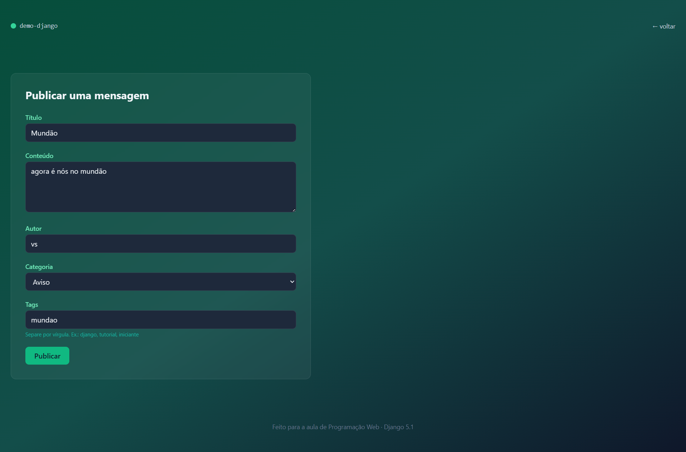
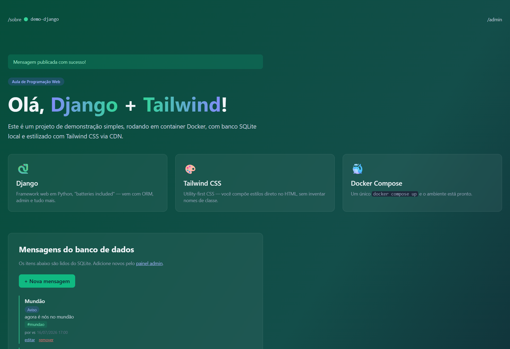
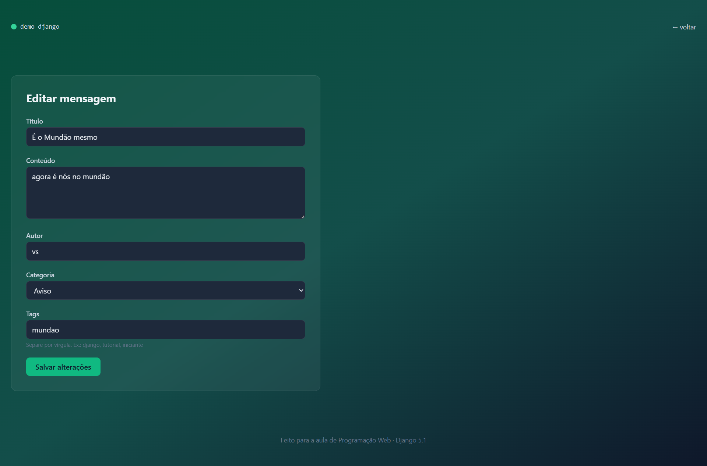
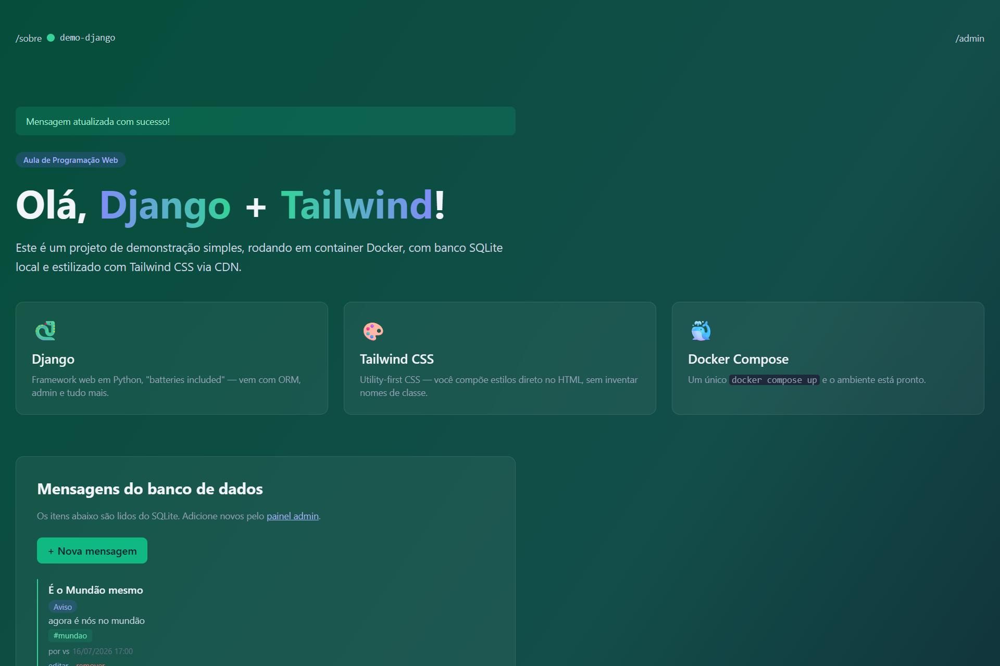
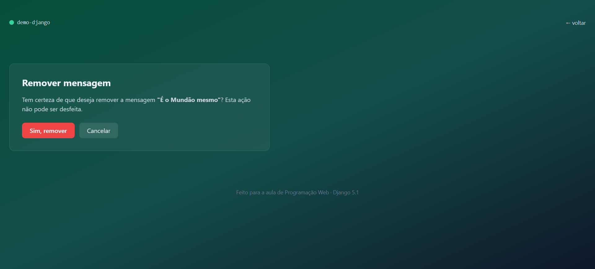
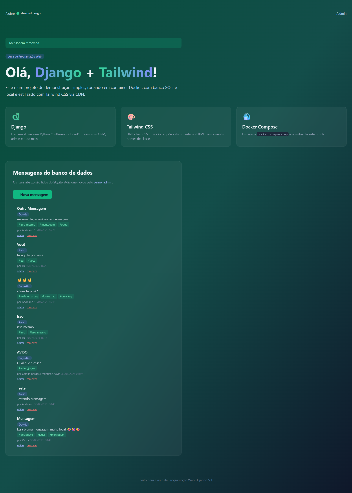

# Demo Django 

## Roteiro VI — Editar e remover: finalizando o ciclo CRUD com Django

Execução do sexto roteiro prático da disciplina de Programação Web

### Sistema em execução:

#### Create:

#### Read:

#### Update:

#### Delete:

