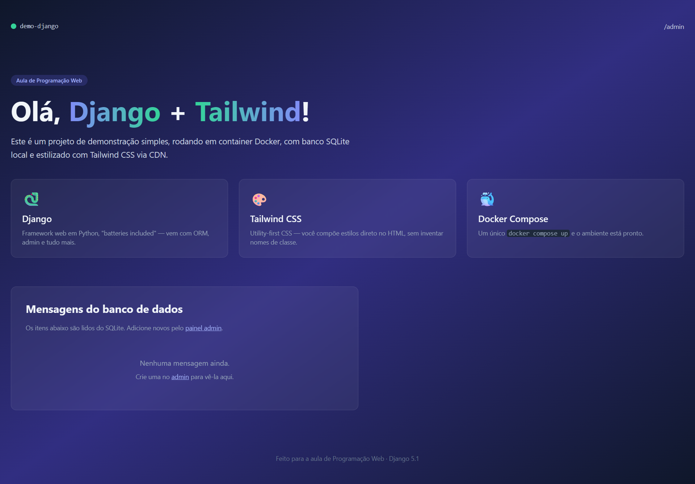

# Demo Django 

## Roteiro I — Construindo um site com Django + Tailwind + Docker

Execução do primeiro roteiro prático da disciplina de Programação Web

### Sistema em execução:

## Roteiro II — Criação de Modelos e Cadastramento de Entidades

Execução do segundo roteiro prático da disciplina de Programação Web

### Sistema em execução:

## Roteiro III — Criação de modelos e relacionamento com DJango

Execução do terceiro roteiro prático da disciplina de Programação Web

### Sistema em execução:

## Roteiro IV — Criando modelos e relacionamento muitos-para-muitos com DJango

Execução do quarto roteiro prático da disciplina de Programação Web

### Sistema em execução:

